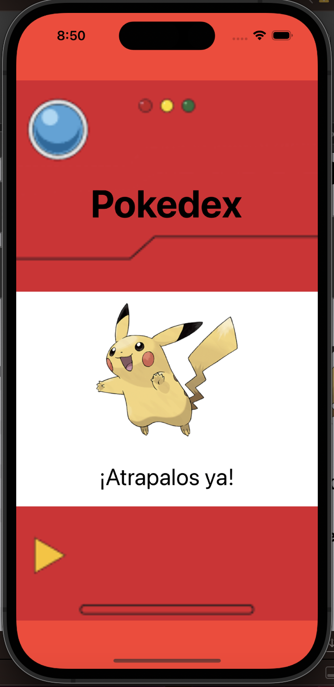
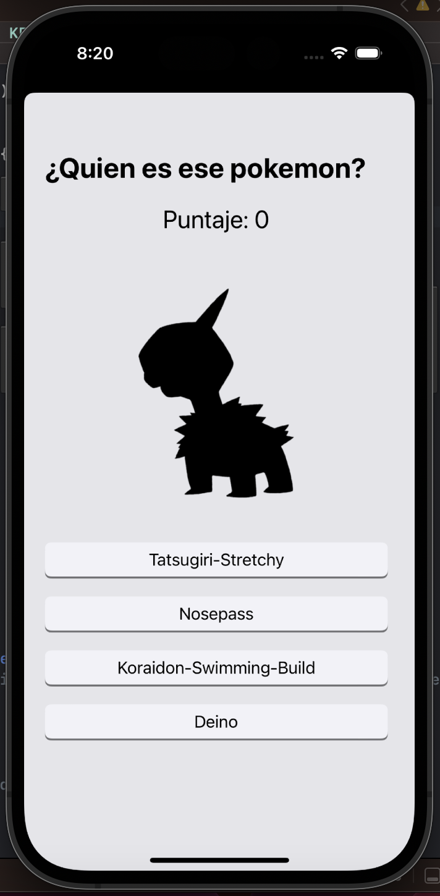
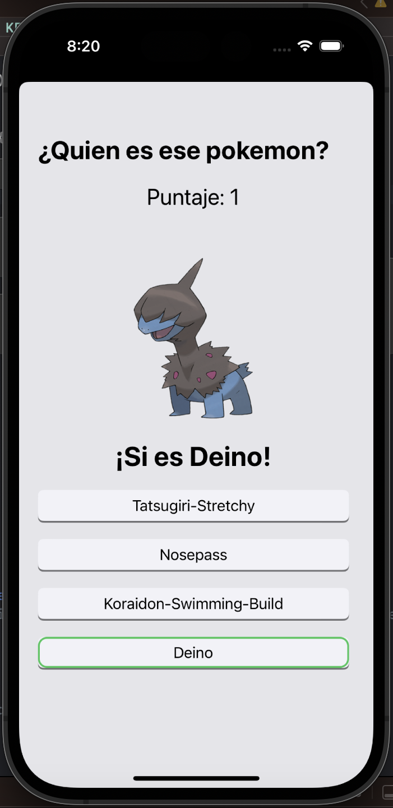
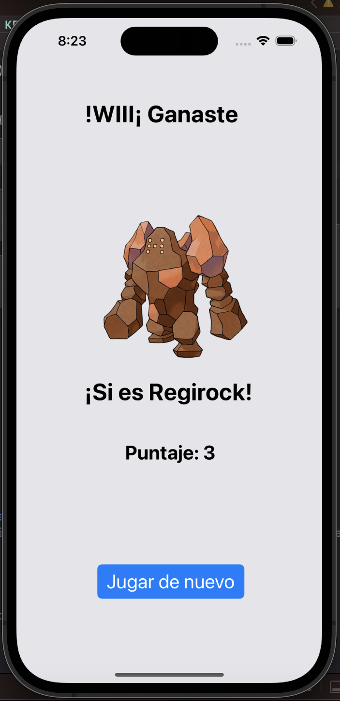

# pokedex
App para jugar ¿Quién es ese pokemón?

## Instalación

Utiliza la dependencia [Kingfisher](https://swiftpackageindex.com/onevcat/Kingfisher) para tratar las imagenes.

Para usarlo solo debe importar la dependencia
```bash
import Kingfisher
```

Son 5 oportunidades, para ganar necesitas un minimo de 3 aciertos.

Los pokemon pueden aparecer en estado normal o shiny.

<p align="center">
	
	
	
	
</p>


